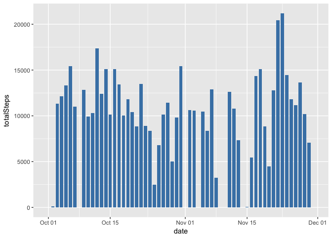
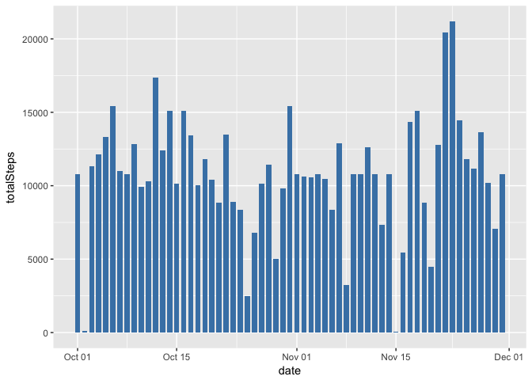
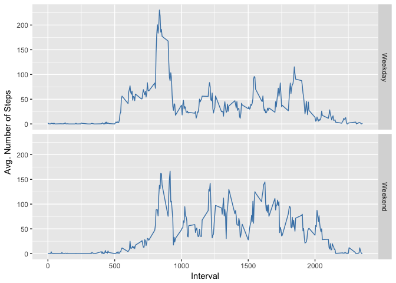

# Reproducible Research: Peer Assessment 1

## Loading and preprocessing the data

Step 1 is to load the data from our raw CSV file. The only pre-processing
needed is to convert the 'date' column into a proper date object with the
**ymd()** from the *lubridate* package


```r
library(readr)
library(lubridate)
```

```
## 
## Attaching package: 'lubridate'
```

```
## The following object is masked from 'package:base':
## 
##     date
```

```r
rawData <- read.csv("./activity.csv")
rawData$date <- ymd(rawData$date)
```
## What is mean total number of steps taken per day?

For this step, we first need to  group our data per day. We will use some functions from the *dplyr* package. We will also use the **plyr** package later so attach that first to avoid masking problems:


```r
library(plyr);library(dplyr)
```

```
## 
## Attaching package: 'plyr'
```

```
## The following object is masked from 'package:lubridate':
## 
##     here
```

```
## 
## Attaching package: 'dplyr'
```

```
## The following objects are masked from 'package:plyr':
## 
##     arrange, count, desc, failwith, id, mutate, rename, summarise,
##     summarize
```

```
## The following objects are masked from 'package:lubridate':
## 
##     intersect, setdiff, union
```

```
## The following objects are masked from 'package:stats':
## 
##     filter, lag
```

```
## The following objects are masked from 'package:base':
## 
##     intersect, setdiff, setequal, union
```

```r
perDay <- group_by(rawData, date)
```

Then we can calculate the total number of steps taken per day. We are disregarding NA values as per the assignment rubric


```r
perDaySum <- summarise(perDay, totalSteps = sum(steps, na.rm = TRUE))
```

Now we can plot this on a histogram:


```r
library(ggplot2)

h <- ggplot(perDaySum, aes(date, totalSteps)) +
        geom_histogram(stat = "identity", width=.75, fill = "steelblue")
```

```
## Warning: Ignoring unknown parameters: binwidth, bins, pad
```

```r
print(h)
```

<!-- -->

Now we can calculate the mean and median steps taken per day:


```r
mean <- mean(perDaySum$totalSteps)
median <- median(perDaySum$totalSteps)
```

So, the mean is **9354.2295082** and the median is **10395**

## What is the average daily activity pattern?

For this section, we are interested in the average steps per 5 minute interval, averaged across all days so we need to group the data by interval. We can then compute the mean of each interval across all days and plot it as a time-series. We can also ascertain which 5 minute interval averaged the most number of steps across the data


```r
perInterval <- group_by(rawData, interval)

perIntervalMean <- summarise(perInterval, mn = mean(steps, na.rm = TRUE))

i <- ggplot(perIntervalMean, aes(interval, mn)) +
        geom_line(col = "steelblue")

print(i)
```

<!-- -->

```r
most <- tail(arrange(perIntervalMean, mn), 1)$interval
```

We can also see that the interval labelled **835** had the highest average number of steps


## Imputing missing values

First, we wil figure out how many rows are missing steps values:


```r
missing <- sum(is.na(rawData$steps))
```

So we can see we have 2304 missing values we need to impute. I have selected the simple strategy of replacing NA values with the mean value for that 5 minute interval across days. We can now plot a histogram of this new dataset and compare it to the one computed earlier:


```r
impute.mean <- function(x) replace(x, is.na(x), mean(x, na.rm = TRUE))
complete <- ddply(rawData, ~ interval, transform, steps = impute.mean(steps))

perDayComplete <- group_by(complete, date)

perDayCompleteSum <- summarise(perDayComplete, totalSteps = sum(steps))

j <- ggplot(perDayCompleteSum, aes(date, totalSteps)) +
        geom_histogram(stat = "identity", width=.75, fill = "steelblue")
```

```
## Warning: Ignoring unknown parameters: binwidth, bins, pad
```

```r
print(j)
```

<!-- -->

Now we can calculate the mean and median steps of our new, complete dataset:


```r
completeMean <- mean(perDayCompleteSum$totalSteps)
completeMedian <- median(perDayCompleteSum$totalSteps)
```

So, the mean is **1.0766189\times 10^{4}** and the median is **1.0766189\times 10^{4}**

## Are there differences in activity patterns between weekdays and weekends?

To compare activity levels between weekdays and weekends, we will add a two-level factor variable to our complete data set which indicates what type of day an observation refers to:


```r
weekendDays <- c("Saturday", "Sunday")

weekends <- filter(complete, weekdays(date) %in% weekendDays)
weekdays <- filter(complete, !weekdays(date) %in% weekendDays)

weekends <- mutate(weekends, weekend = "Weekend")
weekdays <- mutate(weekdays, weekend = "Weekday")

completeWeekends <- bind_rows(weekends, weekdays)

completeWeekendsGrouped <- group_by(completeWeekends, weekend, interval)

completeWeekendsMean <- summarise(completeWeekendsGrouped, mn = mean(steps))
```

Now we can make a panel plot comparing the differences in activity between weekdays and weekends:


```r
p <- ggplot(completeWeekendsMean, aes(interval, mn)) +
        geom_line(col = "steelblue") +
        facet_grid(weekend ~ .) +
        labs(x = "Interval", y = "Avg. Number of Steps")

print(p)
```

<!-- -->
